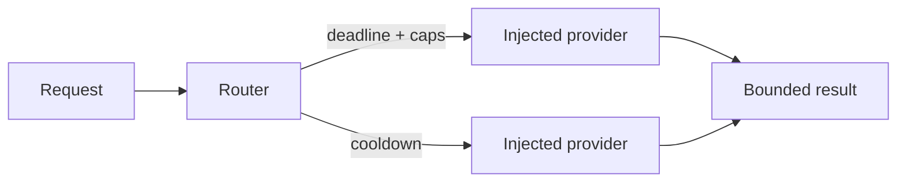

# Genesis Worker Router

Bounded provider routing for workflows that need shared deadlines, retry limits, daily account caps, concurrency limits, and explicit cooldowns.

[](https://nodejs.org/) [](LICENSE)



## Run locally

```sh
git clone https://github.com/Wassimyounes01/genesis-worker-router.git
cd genesis-worker-router
npm test
npm run demo
```

No dependency installation is required. The complete runnable setup is in [examples/demo.cjs](examples/demo.cjs); API snippets illustrate integration shapes.


Use it to coordinate multiple worker accounts, enforce a hard request budget in a service, or wrap a session-only CLI that must run in a disposable directory.

## Five-minute offline quickstart

```js
const { createRouter } = require('./index.cjs');
const router = createRouter({ providers: [{ name: 'demo', invoke: async ({ prompt }) => ({ ok: true, text: prompt }) }] });
console.log(await router.run({ prompt: 'hello' }));
```

The real integration API is the same: inject a provider with `invoke({ prompt, signal, attempt, deadlineAt })`. The router never supplies credentials or infers model identity or cost. `createSessionCliAdapter({ executable, askMode, tempRoot })` is an opt-in adapter that uses `spawn` with `shell:false`, stdin, a disposable cwd, bounded stdout/stderr, and cleanup.

Core invariants are shared deadlines, bounded attempts, daily reservations, concurrency caps, account cooldowns, and bounded result text. Provider calls remain the caller's responsibility; there is no API-key fallback, shell fallback, local inference, scheduling, or publishing. Unknown model and cost fields remain `null`.

Run `npm test` for isolated tests and `npm run demo` for the offline demonstration. See [genesis-suite](https://github.com/Wassimyounes01/genesis-suite) and adjacent components [genesis-night-research](https://github.com/Wassimyounes01/genesis-night-research), [genesis-repo-atlas](https://github.com/Wassimyounes01/genesis-repo-atlas).
