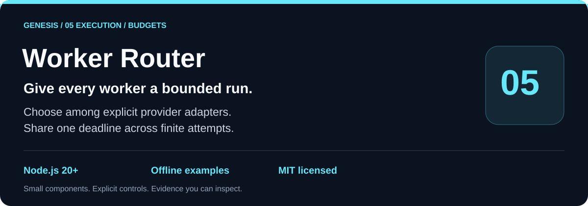
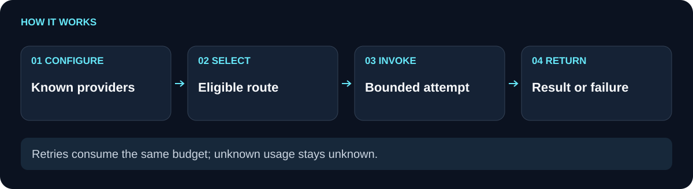

# genesis-worker-router

 [](https://nodejs.org/)

`genesis-worker-router` routes work across explicitly injected providers while sharing a deadline, attempt budget, concurrency limit, daily account cap, cooldown, and output bound. It accepts a provider callback or an opt-in session CLI adapter and returns explicit success or structured failure data. Credentials, provider identity, model selection, and cost remain the caller’s responsibility.

**Shared request budgets.** **Explicit provider contracts.** **Bounded process output.**

[Use cases](#use-cases) · [How it works](#how-it-works) · [Quickstart](#quickstart) · [API](#api) · [Comparison](#comparison) · [Limitations](#limitations) · [Related components](#related-components)

## Use cases

Use the router when a service has several already-configured worker callbacks, when attempts should rotate across eligible accounts, or when a session-only CLI needs a disposable working directory and bounded stdout/stderr. It is useful as the invocation layer beneath a planner and above provider-specific adapters.

In a fictional batch run, the first worker account reaches its daily cap while a second account is still eligible, and an unbounded retry loop would keep waiting on the first. With the router, the shared attempt and deadline rules select eligible providers, cool down failures, and return a bounded structured result.

Use simpler code when one trusted callback handles one request and you do not need retries, account caps, concurrency control, or a session CLI boundary.

## How it works

<picture>
  <source media="(max-width: 600px)" srcset="docs/flow-compact.svg">
  
</picture>

Construct `WorkerRouter` with a nonempty `providers` array. Each provider has an `invoke({ prompt, signal, attempt, deadlineAt })` function and may include `name`, `accountId`, and `models`. `run({ prompt, model?, signal?, deadlineMs? })` validates the request, selects eligible providers in round-robin order, reserves daily usage, waits for a concurrency slot, and invokes up to `maxAttempts` before the shared deadline.

A provider must return an object with explicit `ok: true` or `ok: false`. Successful results need nonempty text and are bounded by `outputCap`; partial or marked-truncated results are rejected. Retryable failures cool down the provider account and may allow another eligible provider. Successful results report attempts, requested model, elapsed time and provider-reported usage. Failure results also include providersTried. Absent `actualModel` and `monetaryCost` stay `null`.

`createSessionCliAdapter({ executable, askMode, tempRoot? })` creates a provider-shaped adapter. It starts the executable with `shell: false`, a disposable cwd, scrubbed API-key/token/secret environment variables, bounded output, timeout and cleanup. The flow image shows eligibility and limits surrounding an injected provider; the provider remains outside this package.

## Quickstart

```sh
git clone https://github.com/Wassimyounes01/genesis-worker-router.git
cd genesis-worker-router
npm test
npm run demo
```

Node.js 20 or newer is required. The package has no runtime dependencies, so no `npm install` is needed. The demo injects an offline provider, runs one prompt with one attempt and a daily cap of two, prints the structured JSON result, and exits without credentials or network access.

## API

```js
const { createRouter } = require('./index.cjs');

const router = createRouter({
  providers: [{
    name: 'offline-demo',
    accountId: 'demo',
    invoke: async ({ prompt }) => ({ ok: true, text: `Handled: ${prompt}` }),
  }],
  maxAttempts: 2,
  maxConcurrency: 1,
  dailyCap: 10,
  accountCooldownMs: 30_000,
  deadlineMs: 5_000,
});

async function main() {
  const result = await router.run({ prompt: 'summarize this bounded workflow' });
  console.log(result);
}
main().catch(error => {
  console.error(error);
  process.exitCode = 1;
});
```

The public exports are `WorkerRouter`, `createRouter`, `createSessionCliAdapter`, `scrubEnvironment`, and `bounded`. Provider and result schemas, including explicit unknown model and cost fields, are in [module-manifest.json](module-manifest.json). [examples/demo.cjs](examples/demo.cjs) is the smallest offline integration.

## Comparison

| Invocation need | A loop around provider calls | `genesis-worker-router` |
| --- | --- | --- |
| Share a request deadline | Each call may set its own timeout | One deadline covers queue wait, retries, and provider invocation |
| Bound concurrency | Caller must track active work | `maxConcurrency` reserves and releases slots, including non-cooperative timeouts |
| Cap account usage | Counters are easy to scatter across adapters | Daily reservations are keyed by date and provider account |
| Handle transient failure | Retry logic may repeat one account | Eligible providers rotate, failures can cool down an account, and attempts are bounded |
| Run a session CLI safely | Shell and temporary files are adapter details | Opt-in adapter uses `shell:false`, scrubbed environment, bounded output, and cleanup |

## Limitations

Providers are callbacks supplied by the caller; the router does not authenticate them, verify their model or cost claims, or provide credentials. Daily usage and cooldown state live in memory and are not a durable multi-process quota service. A non-cooperative provider can keep a concurrency slot reserved until its promise settles, which may make later requests hit their deadline. Abort signals depend on provider cooperation for prompt cancellation. The package does not schedule, persist job history, guarantee delivery, or make a failed provider succeed. Unknown model and monetary cost fields remain `null` unless the provider reports them.

The tests cover malformed limits and provider results, pre-abort behavior, non-retryable failures, deadline and concurrency handling, shared attempts and daily caps, unknown usage fields, CLI environment scrubbing, `shell:false`, temporary cwd cleanup, and exact output caps. Run `npm test` to verify these behaviors.

## Related components

- [genesis-plan-graph](https://github.com/Wassimyounes01/genesis-plan-graph) selects dependency-ready work before dispatch.
- [genesis-task-ledger](https://github.com/Wassimyounes01/genesis-task-ledger) records checks, artifact proofs, and independent review.
- [genesis-task-adaptation](https://github.com/Wassimyounes01/genesis-task-adaptation) records feedback and durable rechecks.
- [genesis-context-graph](https://github.com/Wassimyounes01/genesis-context-graph) matches current source-backed context.
- [genesis-suite](https://github.com/Wassimyounes01/genesis-suite) integrates the public modules.
